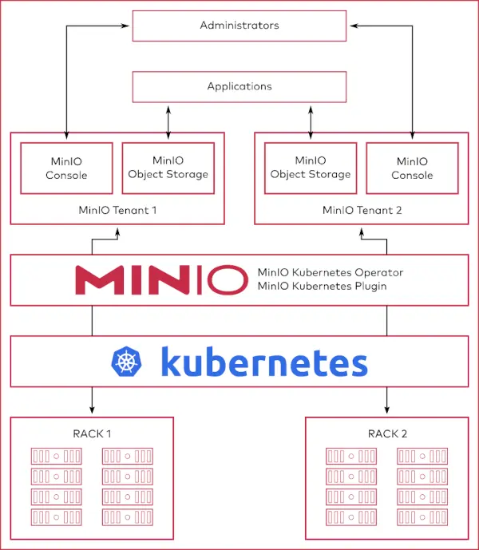

# [MinIO](https://charts.min.io/ "charts.min.io")

>MinIO is a high-performance __S3 compatible object store__ that is OSS (GNU AGPLv3).

## [MinIO Server](https://min.io/docs/minio/linux/developers/minio-drivers.html "min.io/docs")

```bash
image=quay.io/minio/minio  # 
store='-v /mnt/data:/data' # Optional persistent storage

docker run -p 9000:9000 -p 9001:9001 $store $image \
    server /data --console-address ":9001"
```
- Web @ __`http://127.0.0.1:9000`__
- Creds : __`minioadmin:minioadmin`__

__Browser__ :

Test the deployment using the __MinIO Console__, 
an embedded-object browser built into MinIO Server. 
__Use to create buckets__, __upload objects__, 
and __browse the contents__ of the MinIO server.

__S3 Client__ :

MinIO Client `mc`, or any other S3-compatible tool.

## K8s : [MinIO Operator](https://github.com/minio/operator/blob/master/README.md)

>MinIO is a Kubernetes-native high performance object store with an S3-compatible API. The MinIO Kubernetes Operator supports deploying __MinIO Tenants__ onto private and public cloud infrastructures ("Hybrid" Cloud).

__Architecture__:

Each MinIO Tenant represents an independent MinIO Object Store within the Kubernetes cluster.


